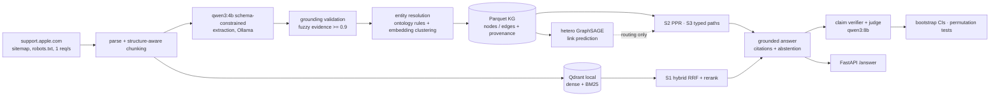

# FixGraph

**Does structured graph retrieval improve correctness and faithfulness on multi-hop
troubleshooting questions compared with strong hybrid RAG, and at what cost?**

FixGraph turns public Apple support articles into a typed, provenance-tracked troubleshooting
knowledge graph (product → symptom → cause → fix), reproduces HippoRAG-style Personalized
PageRank retrieval, trains a heterogeneous GNN for symptom→fix link prediction, and benchmarks
graph retrieval against hybrid RAG. Everything runs **locally on a laptop GPU (RTX 4050, 6 GB)
with free open-weight models** (qwen3:4b / qwen3:8b via Ollama, Qwen3-Embedding-0.6B,
bge-reranker-v2-m3). Inference cost: $0.


## Results (dev run, 2026-09-23)

> **Read this first.** These are results on a small, time-boxed **dev** benchmark: 30
> hand-written questions over a 220-article / 500-chunk corpus. The questions and the
> extraction gold set were drafted by an AI assistant from the corpus text and are **not yet
> human-verified**; judge–human agreement (κ) is **not yet measured**. Treat the numbers as a
> working baseline, not the final answer to the research question. See [Limitations](#limitations).
>
> Every number below comes from committed artifacts in [`results/`](results/):
> `results/dev/report.{md,json}` (benchmark, per-question metrics), `results/kg/stats.json` and
> `results/kg/extraction_eval_vs_draft_gold.json` (knowledge graph), `results/gnn/results.{md,json}`.

### Answering (30 questions, qwen3:4b answers, qwen3:8b judge; mean [95% bootstrap CI])

| metric | S0 closed-book | S1 hybrid RAG | S2 PPR GraphRAG | S3 typed paths |
|---|---|---|---|---|
| correctness (0/0.5/1) | 0.40 [0.30, 0.50] | **0.73** [0.62, 0.83] | 0.68 [0.57, 0.80] | 0.63 [0.52, 0.75] |
| key-fact recall | 0.46 [0.31, 0.61] | **0.99** [0.96, 1.00] | 0.94 [0.85, 1.00] | 0.82 [0.69, 0.93] |
| recall@8 (gold chunks) | — | **1.00** | 0.96 [0.89, 1.00] | 0.83 [0.70, 0.94] |
| support-set complete@8 | — | **1.00** | 0.96 [0.89, 1.00] | 0.78 [0.63, 0.93] |
| citation precision | — | **0.87** [0.78, 0.94] | 0.80 [0.70, 0.89] | 0.78 [0.64, 0.91] |
| citation recall | — | 0.90 [0.81, 0.98] | **0.93** [0.83, 1.00] | 0.75 [0.62, 0.87] |
| unsupported-claim rate (verifier) | — | 0.08 [0.04, 0.13] | 0.08 [0.04, 0.13] | 0.08 [0.03, 0.12] |
| abstention recall (3 unanswerable) | 0.00 | 0.33 | 0.33 | 0.33 |
| latency p50 / p95 (s, RTX 4050) | 3.7 / 4.5 | 6.1 / 8.5 | 6.1 / 8.0 | 5.3 / 7.4 |

Paired permutation tests vs S1 (Holm-corrected): all systems with retrieval beat closed-book
by a wide margin (correctness −0.33 for S0, p = 0.001). **Neither graph system is
significantly different from hybrid RAG** on correctness (S2 −0.05, p = 0.38; S3 −0.10,
p_Holm = 0.25). S3 loses retrieval recall (−0.17, p = 0.035, p_Holm = 0.069).

**What this says.** On questions whose answer sits in a single article with a descriptive
title, strong hybrid RAG is already at the retrieval ceiling (recall@8 = 1.00), so graph
retrieval has nothing to add and path search's narrower candidate set costs some recall. The
research question needs multi-article questions (cross-device dependencies, error-code chains
across articles), which is what the path-based generator (`fixgraph bench generate`) produces;
that benchmark plus human verification is the next step. Grounding works across systems:
~80–87% of citations point at gold evidence and the verifier finds 8% unsupported claims.
Abstention is weak for a 4B model: 2 of 3 unanswerable questions were answered anyway.

### Test benchmark: multi-article questions (2026-09-25)

> **Status:** 191 questions generated from KG paths (D27–D29); **93 kept after review**.
> The review was done by a model (Claude Opus 5.5, `verified_by: claude-opus-5-5`), not a
> human: every question was checked against the full text of its gold chunks, with a
> keep/reject reason per question in `data/bench/generated_review.jsonl`. It is stricter than
> the automatic pre-screen (27 kept questions had failed the screen, ~46 that passed it were
> rejected) but it is **not human verification**. The qwen3:8b judge's κ against blind labels
> is **0.38**, below the 0.6 target (see [Judge validation](#judge-validation)), so treat
> correctness as a ranking signal, not an absolute score. Retrieval metrics need no judge.
>
> Artifacts: `results/test/report_verified.{md,json}` (93 reviewed questions),
> `results/test/report.{md,json}` (all 191), `results/test/retrieval_recall_at8.json`,
> `results/test/judge_kappa.json`.

93 reviewed questions (49 multi-article, 44 single-article; 43 multi_constraint, 31
single_hop, 11 error_code, 8 version_conditional). Mean [95% bootstrap CI]:

| metric | S0 closed-book | S1 hybrid RAG | S2 PPR GraphRAG | S3 typed paths |
|---|---|---|---|---|
| correctness (0/0.5/1) | 0.31 [0.26, 0.37] | **0.65** [0.58, 0.71] | 0.62 [0.55, 0.68] | 0.58 [0.52, 0.64] |
| key-fact recall | 0.29 [0.22, 0.36] | **0.78** [0.71, 0.85] | 0.77 [0.69, 0.84] | 0.71 [0.63, 0.78] |
| recall@8 (gold chunks) | — | **0.91** [0.87, 0.95] | 0.84 [0.77, 0.90] | 0.80 [0.73, 0.87] |
| support-set complete@8 | — | **0.83** [0.75, 0.90] | 0.74 [0.66, 0.83] | 0.74 [0.66, 0.83] |
| citation precision | — | 0.57 [0.51, 0.64] | 0.57 [0.50, 0.65] | 0.59 [0.52, 0.67] |
| citation recall | — | **0.77** [0.71, 0.83] | 0.71 [0.64, 0.78] | 0.70 [0.62, 0.77] |
| unsupported-claim rate (verifier) | — | 0.10 [0.07, 0.13] | 0.11 [0.09, 0.15] | 0.10 [0.07, 0.14] |
| latency p50 / p95 (s, RTX 4050) | 3.6 / 4.5 | 6.1 / 7.9 | 6.2 / 8.5 | 5.3 / 7.1 |

Paired permutation tests vs S1, Holm-corrected:

| subset | metric | S2 − S1 (p_Holm) | S3 − S1 (p_Holm) |
|---|---|---|---|
| all 93 | recall@8 | −0.08 (0.013) | −0.12 (0.013) |
| all 93 | correctness | −0.03 (0.43) | −0.07 (0.16) |
| multi-article (49) | recall@8 | −0.13 (0.053) | −0.12 (0.076) |
| multi-article (49) | correctness | +0.01 (1.00) | −0.01 (1.00) |

recall@8 by subset (uncorrected p vs S1):

| questions | n | S1 | S2 | S3 | p (S2 / S3 vs S1) |
|---|---|---|---|---|---|
| all generated | 191 | 0.81 | 0.77 | 0.71 | 0.111 / 0.001 |
| reviewed | 93 | **0.91** | 0.84 | 0.80 | 0.012 / 0.006 |
| reviewed, multi-article | 49 | **0.84** | 0.71 | 0.71 | 0.026 / 0.076 |
| reviewed, single-article | 44 | 1.00 | 0.98 | 0.89 | 1.000 / 0.062 |
| reviewed, multi_constraint | 43 | **0.85** | 0.72 | 0.71 | 0.038 / 0.057 |
| reviewed, single_hop | 31 | 0.98 | 0.95 | 0.82 | 1.000 / 0.032 |
| reviewed, error_code | 11 | 1.00 | 1.00 | 1.00 | 1.000 / 1.000 |
| reviewed, version_conditional | 8 | 0.88 | 0.81 | 0.94 | 1.000 / 1.000 |

**What this says.** Multi-article questions take hybrid RAG off the retrieval ceiling
(1.00 → 0.84), so the benchmark separates systems, and **graph retrieval does not beat it**:
both graph systems retrieve significantly less gold evidence over the reviewed set, and on
multi-article questions the gap is largest (−0.13) though no longer significant after Holm
correction at n = 49. Answer correctness is statistically indistinguishable across S1–S3; the
answer model recovers from missing evidence about as often as it is misled by it. Entity
linking is not the bottleneck (74% of gold seed nodes are linked): the questions name both
symptoms, so dense + BM25 already find both articles. A likely (untested) reason PPR does worse
is that its mass spreads over the shared fix node's many neighbours.

**What the review removed.** All 30 cross_device questions were rejected: the claimed
dependency between devices ("the iPhone depends on the car/Mac/Watch") is never stated in the
evidence, so the generator's DEPENDS_ON paths are not trustworthy and the one type where PPR
led before (n = 15) is gone. Most version_conditional questions were rejected for the known
over-merge (a "macOS 14.1" requirement from an unrelated camera article attached through a
shared "Restart your Mac" node). Others were rejected because the gold answer was a setup step
("Locate your device", "Tap General") or contradicted the evidence.

#### Judge validation

99 answers from the reviewed questions, balanced across S0–S3 (`fixgraph bench label`
sampling), were labelled blind (system hidden) with the judge's rubric by two independent
Claude Opus 5.5 labelers; each labeled all 99. Labeler–labeler agreement: **κ = 0.91** (94/99
identical); the 5 disagreements were adjudicated. Labels: `data/bench/judge_labels_test.jsonl`
(final), `data/bench/judge_labels_test_raters.jsonl` (both raters, reasons, adjudications).

| | n | Cohen's κ | linear-weighted κ | exact agreement | mean score (judge / labels) |
|---|---|---|---|---|---|
| qwen3:8b judge vs labels | 99 | **0.38** | 0.50 | 0.57 | 0.55 / 0.67 |

Judge (columns) vs labels (rows):

| labels \ judge | 0 | 0.5 | 1 |
|---|---|---|---|
| 0 | 14 | 9 | 0 |
| 0.5 | 4 | 15 | 0 |
| 1 | 0 | 30 | 27 |

The judge is **systematically one step harsher**, not noisy: it gives 0.5 to 30 of the 57
answers the labelers scored fully correct, and never disagrees by two steps. System means on
the labeled sample keep the same order under both (S1 0.78 / S2 0.78 / S3 0.77 / S0 0.36 by
labels; 0.66 / 0.66 / 0.58 / 0.28 by the judge), so comparisons between systems are more
trustworthy than absolute correctness. κ is below the 0.6 target, and the reference labels are
from a model, not a human; a human-labeled sample is still needed.

### Second round: cleaner graph, true multi-hop questions, fusion (2026-09-25)

Protocols D32–D36 in `docs/DECISIONS.md` were written before each run. All labels and reviews
in this round are by Claude Opus 5.5 (`claude-opus-5-5`), not humans; Claude never grades
answers or verifies edges, so no Claude output is scored against other Claude output.

**1. Edge audit and verification** (`results/kg/edge_verification.json`). A stratified random
sample of 209 extracted edges was labelled blind by two raters (κ = 0.82, 18 of 235 statements
adjudicated): **31.4% of edges are not stated by their source text** (95% CI 25.4–37.5%). Worst:
DEPENDS_ON 5/5, ADDRESSES 15/29, CAUSED_BY 13/26; the core RESOLVED_BY relation 14/71. A
qwen3:8b check of every edge against its source chunk, with a code-verified quote
(`fixgraph kg verify-edges`), kept 2,317 of 2,902 edges:

| | before | after verification |
|---|---|---|
| unsupported edges (population-weighted) | 31.4% [25.4, 37.5] | 23.3% [16.9, 29.9] |
| true edges kept (recall) | — | 87.3% (124/142) |
| unsupported edges removed | — | 43.3% (29/67) |

The verifier keeps true edges well but is lenient; it was not tuned on these labels (D32).

**2. Retrieval on the verified graph, 93 reviewed questions**
(`results/kg/retrieval_after_cleaning.json`; recall@8; p = paired permutation vs S1):

| | S1 hybrid | S2 PPR | S2L PPR + article links | S3 paths | **S4 fusion (S1 + S2L)** |
|---|---|---|---|---|---|
| all (93) | 0.915 | 0.841 (p=0.013) | 0.856 (p=0.031) | 0.758 (p<0.001) | **0.918** (p=1.0) |
| multi-article (49) | 0.838 | 0.719 | 0.747 | 0.660 | **0.845** |

Verification changed the graph systems little (S2 0.836 → 0.841; S3 0.799 → 0.758). Fusion
matches the best system on both subsets; no graph-only system reaches S1.

**3. Bridge benchmark: true multi-hop questions from Apple's own links**
(`results/bridge/bridge_report.json`, frozen set `results/bridge/frozen.json`, rule D35).
Apple articles link to each other in conditional sentences ("If your computer doesn't
recognize your device, learn how to use recovery mode"). Each of 78 reviewed pairs has a
**bridge** question (A's situation; the linked concept is never named) and a **direct**
question (asks for C's content outright) with the same gold chunk in C. Questions were written
by Claude from a seeded, pre-registered candidate rule, checked mechanically in code, reviewed
by a separate Claude instance (78 of 108 pairs kept) and frozen by hash before any system ran.
Answer-chunk hit@8, mean [95% CI], Holm-corrected p vs S1:

| | S1 hybrid | S2 PPR | S2L PPR + links | S3 paths | S4 fusion |
|---|---|---|---|---|---|
| bridge (78) | **0.83** [0.76, 0.92] | 0.42 (p<0.001) | 0.41 (p<0.001) | 0.27 (p<0.001) | 0.78 (p=0.13) |
| direct (78) | **1.00** | 0.56 (p<0.001) | 0.62 (p<0.001) | 0.45 (p<0.001) | **1.00** |
| hop cost (direct − bridge) | 0.17 | 0.14 | 0.21 | 0.18 | 0.22 |

**What this says.** Even on questions whose answer sits behind an unnamed link, hybrid
retrieval finds the answer chunk 83% of the time, and no graph variant closes the gap; adding
Apple's links to the graph (S2L) does not help the bridge questions (0.41 vs 0.42). The hop
costs S1 only 17 points, because the customer's description of the situation is usually
enough for dense + BM25 search to reach the target article. No system's hop cost differs
significantly from S1's (crossover tests, all p_Holm ≥ 0.52). Answer correctness on this set
has not been run yet (retrieval-only round).

### Third round: can a graph + hybrid combination beat hybrid alone? (2026-09-25)

Protocol D37–D38; the test split was hash-frozen and the finalists committed (`6b5acd3`)
before the test split was cached or scored. One test run, no tuning afterwards.

**Ceiling first** (`results/combo/miss_analysis.json`). S1 misses 18/171 gold chunks (main) and
19/234 (bridge). 25 of those 37 misses are already in S1's top-30 candidates and are demoted by
the cross-encoder. Verified-KG routes open 200–480 chunks per question (no usable signal);
Apple's article links open about 20 and reach 28% (main) / 95% (bridge) of misses. The edge
source for every combination is therefore **Apple's human-authored link graph, not the
LLM-extracted KG**.

**Dev search** (`results/combo/dev_log.json`, 16 configurations plus a mis-scaled first grid kept
in `dev_log_grid1_logit_scale.json`): no configuration beat S1 on the main dev set; union +
rerank reproduced S1 exactly. Finalists: a routed link prior (cross-encoder probability + 0.1
for chunks of articles Apple-linked to S1's top 3 or top 1, applied only when S1's top score is
below the dev median).

**Locked test** (`results/combo/test_report.json`; 36 main + 62 bridge questions):

| | n | S1 | link prior (top 3) | link prior (top 1) | p_Holm |
|---|---|---|---|---|---|
| main recall@8 | 36 | 0.891 [0.83, 0.95] | 0.891 | 0.891 | 1.0 |
| bridge answer-chunk hit@8 * | 31 | 0.806 | 0.871 | 0.871 | 0.99 |
| direct answer-chunk hit@8 * | 31 | 1.000 | 1.000 | 1.000 | 1.0 |
| recovered / broken gold chunks | | | +3 / −2 (all bridge) | +2 / −1 (all bridge) | |
| added latency per query | | 0.46 s (S1) | +0.08 s | +0.05 s | |

\* Non-independent: bridge pairs were built from the same Apple links (D35, D37).

**Result: a tie.** On the independent main split the combination returns the same chunks as
S1 (no gains, no losses). On bridge questions it answers 2 more of 31, which is not
significant and not independent of the link source. Hybrid retrieval with a cross-encoder
remains the best retriever measured in this project.

### Knowledge graph

qwen3:4b, prompt v2, 500 chunks, 4.9 s/chunk wall-clock (2 concurrent requests, ~9 s each),
0 failed chunks.
**2,201 nodes, 2,926 extracted edges, 100% with provenance**, 94.9% of symptoms have ≥ 1 fix;
largest connected component 1,785 nodes.

| Extraction vs draft gold (50 chunks) | P | R | F1 |
|---|---|---|---|
| Entities (all) | 0.57 | 0.51 | 0.54 |
| Relations (all) | 0.34 | 0.41 | 0.37 |
| Product / Symptom entities | 0.95 / 0.79 | 0.76 / 0.61 | 0.84 / 0.69 |
| EXHIBITS / RESOLVED_BY relations | 0.71 / 0.38 | 0.79 / 0.37 | 0.75 / 0.37 |
| Cause entities / ADDRESSES relations | 0.20 / 0.00 | 0.28 / 0.00 | 0.23 / 0.00 |

The model gets products and symptoms right and struggles with causal structure (which fix
addresses which cause). Part of the Fix/RESOLVED_BY gap is granularity: gold records one main
remedy, the model often lists individual steps.

### GNN link prediction (Symptom → RESOLVED_BY → Fix)

Article-held-out split (~210 held-out links per seed), filtered ranking against all 978 Fix
nodes, 3 seeds:

| model | MRR | Hits@1 | Hits@10 |
|---|---|---|---|
| text cosine | 0.145 ± 0.013 | 0.093 | 0.239 |
| **Adamic–Adar** | **0.319 ± 0.013** | **0.261** | **0.363** |
| DistMult | 0.036 ± 0.009 | 0.018 | 0.055 |
| hetero GraphSAGE (+ text skip) | 0.042 ± 0.003 | 0.009 | 0.083 |

A negative result, reported as such: on this small, sparse graph a classical common-neighbour
heuristic (symptom and fix share a Cause/Component neighbour) beats the learned models, which
overfit a few hundred training pairs. Predicted links are exported with `origin=predicted`
and are never used as evidence; e.g. for *"forgot your iPhone passcode"* the model proposes
*"use your old passcode to unlock your iPhone within 72 hours"* (Passcode Reset), a fix
documented in a different article.

## Project status

| Milestone | Status |
|---|---|
| M0 scaffold, CUDA check, LLM client + cache | done |
| M1 corpus: 1,915 scraped, 1,000 selected, deterministic chunking | done (500-chunk working set) |
| M2 knowledge graph, validation, resolution, quality report | done; gold set pending human review |
| M3 hybrid RAG, grounded answers, verifier, stats harness | done |
| M4 GraphRAG (PPR, typed paths), entity linking | done |
| M5 benchmark: generation, auto-screen, verification | done: 93 reviewed path questions + 78 frozen bridge pairs (D35); judge κ = 0.38, recalibration coded (D33), not yet run |
| M6 GNN: baselines, hetero-SAGE, gap report | done (S4 routing not run) |
| M7 FastAPI, Docker (CI-built), write-up | done |

Next steps (no GPU needed, see [Human review](#human-review)): a human pass over the 93
model-reviewed questions and ~80 human judge labels (the current reference labels are from a
model), then review the 50 gold extraction chunks. If human κ stays below 0.6, recalibrate the
judge prompt (it is one step harsh on fully correct answers) and re-judge; cached answers are
reused, so only the judge stage re-runs.

## Repository layout

```
src/fixgraph/
  core/        pydantic models, config, ontology, paths
  llm/         LLMClient protocol: Ollama native, OpenAI-compatible, fake; SQLite cache
  ingest/      scraper, parser, chunker, corpus selection
  kg/          extraction schema + prompt, validation, resolution, parquet store, quality eval
  retrieval/   BM25, Qdrant index, hybrid RAG, entity linking, PPR, typed paths
  answer/      grounded generation, claim verifier
  bench/       questions, path-based generation, auto-screen, human verification, runner,
               judge, metrics, statistics, judge validation
  gnn/         HeteroData export, splits, baselines, hetero GraphSAGE, evaluation
  api/         FastAPI service
configs/       base.yaml, ontology.yaml
docs/          DECISIONS.md (every design decision), annotation guidelines
data/gold, data/bench   committed annotations and questions (no raw article text)
```

## Limitations

- **Model-reviewed, not human-verified, evaluation data.** The 30 dev questions and the
  50-chunk extraction gold set were drafted by an AI assistant and are still `verified: false`
  / `status: draft`. The 191 test questions were generated by qwen3:8b; 93 were kept by a
  Claude Opus 5.5 review against the evidence text (`verified_by: claude-opus-5-5`, decisions
  in `data/bench/generated_review.jsonl`). A stronger model checking a weaker one's output is
  better than the auto-screen, but it can share blind spots; a human pass is still needed.
- **Judge below target agreement.** qwen3:8b vs blind labels: κ = 0.38 (weighted 0.50) on 99
  answers, target 0.6. The reference labels come from two Claude labelers (κ = 0.91 with each
  other), not a human. The judge is consistently one step harsh, so absolute correctness is
  understated; system rankings agree under both.
- **Auto-screen is a weak filter.** On the test set it kept ~46 questions the review rejected
  and failed 27 it kept.
- **Graph + hybrid combinations tie hybrid on held-out data** (D38): no gain on the independent
  main split; the bridge gain (+2/31) is not significant and depends on the same links the
  bridge questions were built from.
- **Edge verification is lenient.** It removes 43% of unsupported edges while keeping 87% of true
  ones; 23% of the remaining edges are still unsupported (D32). A stricter verifier needs a fresh
  labelled sample to be measured honestly.
- **Graph retrieval does not beat hybrid RAG on any benchmark here**, including true multi-hop
  bridge questions; fusion (S4) only matches it. See the second-round results.
- **cross_device generation is broken.** All 30 generated cross_device questions were rejected:
  the device dependency is never stated in the evidence, so DEPENDS_ON paths need fixing
  before that question type can test graph retrieval.
- **Entity resolution over-merges generic fixes.** Fix nodes such as "Restart your Mac" are
  merged across articles, so a requirement from one article ("macOS 14.1") attaches to
  unrelated symptoms. Most generated `version_conditional` questions inherited this error
  and were rejected in review.
- **Time-boxed corpus.** 500 of 2,531 chunks (whole articles, highest troubleshooting
  relevance); the pipeline runs unchanged on the full corpus.
- **Not run:** 4B vs 8B extraction comparison, S4 (GNN routing), ablations. All are
  implemented as commands; see `docs/DECISIONS.md` D20–D30.
- Data: public support articles, fetched politely (robots.txt, ≤ 1 req/s); raw text is not
  redistributed. This is an independent student project, not affiliated with Apple.

## Architecture



## Systems compared

| ID | System |
|---|---|
| S0 | Closed-book (no retrieval) |
| S1 | Hybrid RAG: dense (Qwen3-Embedding) + BM25 in Qdrant, RRF, cross-encoder rerank |
| S2 | GraphRAG PPR (HippoRAG reproduction): entity linking → Personalized PageRank → chunk scores → rerank |
| S3 | GraphRAG typed paths: schema-valid ≤3-hop paths from linked entities → provenance chunks → rerank |

All systems share the embedding model, reranker, answer model (qwen3:4b), answer prompt and
6k-token context budget; only retrieval differs. Answers must cite a chunk id per sentence,
citations to chunks outside the context are stripped, and a qwen3:8b verifier drops
unsupported claims.

## Reproduce

Third round (D37–D38): `fixgraph bench miss-analysis`, `combo-split`, `combo-cache --split
dev`, `combo-dev`, then (after recording finalists) `combo-cache --split test` and `combo-test`.

Second round (D32–D36): `fixgraph kg edge-sample`, `fixgraph kg verify-edges`, `fixgraph kg
edge-eval`; `fixgraph ingest links`; `fixgraph bench bridge-import` / `bridge-freeze`;
`fixgraph bench run --questions-file data/bench/bridge.jsonl --questions verified --run-name
bridge --systems S1,S2,S3,S2L,S4 --stages mentions,retrieve --kg-dir data/kg_verified`, then
`fixgraph bench bridge-report`; judge calibration: `fixgraph bench judge-calibrate --variant v1
--variant v2 --variant v3 --variant v4`; serving: `scripts/loadtest.py`.

Tested on native Windows 11 (no WSL) with an NVIDIA RTX 4050 Laptop GPU (6 GB), 16 GB RAM.
Prerequisites: [uv](https://docs.astral.sh/uv/), [Ollama](https://ollama.com), a recent NVIDIA
driver (PyTorch wheels bundle the CUDA runtime).

```powershell
uv sync
uv run poe gpu                        # CUDA available: True + GPU name
ollama pull qwen3:4b; ollama pull qwen3:8b
uv run poe check                      # ruff + pyright + unit tests
                                      # (path with a space? uv run python -m poethepoet check)
uv run fixgraph ingest scrape         # ~35 min, polite, cached
uv run fixgraph ingest parse; uv run fixgraph ingest chunk
uv run fixgraph ingest subset --max-chunks 500   # time-boxed working corpus
uv run fixgraph kg extract --limit 50 # sample + projected runtime, then without --limit
bash scripts/run_pipeline.sh          # KG -> eval -> GNN -> index -> benchmark
uv run fixgraph serve                 # FastAPI on :8000
```

Test benchmark (multi-article questions, ~4 h on the RTX 4050):

```powershell
uv run fixgraph bench generate        # 191 questions from KG paths (qwen3:8b)
uv run fixgraph bench screen          # automatic pre-screen, advisory only
uv run fixgraph bench run --questions-file data/bench/generated.jsonl --run-name test
```

See `DATA.md` for data provenance and `docs/DECISIONS.md` for every design decision.

## Human review

Three steps need a person; none needs the GPU. Each saves after every keystroke, so you can
stop and resume. Steps 1 and 2 were run once by a model (see [Judge validation](#judge-validation));
`bench verify` skips questions already marked verified, so a human pass over the model-kept
questions means resetting `verified` first, and `bench label` needs its own labels file
(labels are stored per run in `data/bench/judge_labels_<run>.jsonl`).

```powershell
# 1. Verify test questions (y = keep, n = reject, s = skip, q = quit). Screen-passed,
#    multi-article questions come first.
uv run fixgraph bench verify --reviewer <name>
uv run fixgraph bench report --run-name test --questions-file data/bench/generated.jsonl --questions verified

# 2. Validate the judge: ~80 blind labels (1 = correct, 5 = partial, 0 = wrong), balanced
#    across systems, then Cohen's kappa against the qwen3:8b judge (target >= 0.6).
uv run fixgraph bench label --run-name test --questions-file data/bench/generated.jsonl --questions verified --labeler <name>
uv run fixgraph bench kappa --run-name test

# 3. Review the 50 draft gold extraction chunks (a = accept, e = edit in Notepad), then score
#    extraction against reviewed gold only.
uv run fixgraph kg annotate --reviewer <name>
uv run fixgraph kg eval --status reviewed --out results/kg/extraction_eval_reviewed_gold.json
```
