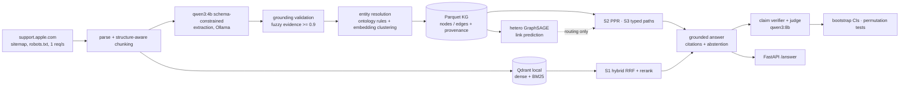

# FixGraph

**Does structured graph retrieval improve correctness and faithfulness on multi-hop
troubleshooting questions compared with strong hybrid RAG, and at what cost?**

FixGraph turns public Apple support articles into a typed, provenance-tracked troubleshooting
knowledge graph (product → symptom → cause → fix), reproduces HippoRAG-style Personalized
PageRank retrieval, trains a heterogeneous GNN for symptom→fix link prediction, and benchmarks
graph retrieval against hybrid RAG. Everything runs **locally on a laptop GPU (RTX 4050, 6 GB)
with free open-weight models** (qwen3:4b / qwen3:8b via Ollama, Qwen3-Embedding-0.6B,
bge-reranker-v2-m3). Inference cost: $0.


## Results (dev run, 2026-09-23)

> **Read this first.** These are results on a small, time-boxed **dev** benchmark: 30
> hand-written questions over a 220-article / 500-chunk corpus. The questions and the
> extraction gold set were drafted by an AI assistant from the corpus text and are **not yet
> human-verified**; judge–human agreement (κ) is **not yet measured**. Treat the numbers as a
> working baseline, not the final answer to the research question. See [Limitations](#limitations).

### Answering (30 questions, qwen3:4b answers, qwen3:8b judge; mean [95% bootstrap CI])

| metric | S0 closed-book | S1 hybrid RAG | S2 PPR GraphRAG | S3 typed paths |
|---|---|---|---|---|
| correctness (0/0.5/1) | 0.40 [0.30, 0.50] | **0.73** [0.62, 0.83] | 0.68 [0.57, 0.80] | 0.63 [0.52, 0.75] |
| key-fact recall | 0.46 [0.31, 0.61] | **0.99** [0.96, 1.00] | 0.94 [0.85, 1.00] | 0.82 [0.69, 0.93] |
| recall@8 (gold chunks) | — | **1.00** | 0.96 [0.89, 1.00] | 0.83 [0.70, 0.94] |
| support-set complete@8 | — | **1.00** | 0.96 [0.89, 1.00] | 0.78 [0.63, 0.93] |
| citation precision | — | **0.87** [0.78, 0.94] | 0.80 [0.70, 0.89] | 0.78 [0.64, 0.91] |
| citation recall | — | 0.90 [0.81, 0.98] | **0.93** [0.83, 1.00] | 0.75 [0.62, 0.87] |
| unsupported-claim rate (verifier) | — | 0.08 [0.04, 0.13] | 0.08 [0.04, 0.13] | 0.08 [0.03, 0.12] |
| abstention recall (3 unanswerable) | 0.00 | 0.33 | 0.33 | 0.33 |
| latency p50 / p95 (s, RTX 4050) | 3.7 / 4.5 | 6.1 / 8.5 | 6.1 / 8.0 | 5.3 / 7.4 |

Paired permutation tests vs S1 (Holm-corrected): all systems with retrieval beat closed-book
by a wide margin (correctness −0.33 for S0, p = 0.001). **Neither graph system is
significantly different from hybrid RAG** on correctness (S2 −0.05, p = 0.38; S3 −0.10,
p_Holm = 0.25). S3 loses retrieval recall (−0.17, p = 0.035, p_Holm = 0.069).

**What this says.** On questions whose answer sits in a single article with a descriptive
title, strong hybrid RAG is already at the retrieval ceiling (recall@8 = 1.00), so graph
retrieval has nothing to add and path search's narrower candidate set costs some recall. The
research question needs multi-article questions (cross-device dependencies, error-code chains
across articles), which is what the path-based generator (`fixgraph bench generate`) produces;
that benchmark plus human verification is the next step. Grounding works across systems:
~80–87% of citations point at gold evidence and the verifier finds 8% unsupported claims.
Abstention is weak for a 4B model: 2 of 3 unanswerable questions were answered anyway.

### Knowledge graph

qwen3:4b, prompt v2, 500 chunks, 4.9 s/chunk, 0 failed chunks.
**2,201 nodes, 2,926 extracted edges, 100% with provenance**, 94.9% of symptoms have ≥ 1 fix;
largest connected component 1,785 nodes.

| Extraction vs draft gold (50 chunks) | P | R | F1 |
|---|---|---|---|
| Entities (all) | 0.57 | 0.51 | 0.54 |
| Relations (all) | 0.34 | 0.41 | 0.37 |
| Product / Symptom entities | 0.95 / 0.79 | 0.76 / 0.61 | 0.84 / 0.69 |
| EXHIBITS / RESOLVED_BY relations | 0.71 / 0.38 | 0.79 / 0.37 | 0.75 / 0.37 |
| Cause entities / ADDRESSES relations | 0.20 / 0.00 | 0.28 / 0.00 | 0.23 / 0.00 |

The model gets products and symptoms right and struggles with causal structure (which fix
addresses which cause). Part of the Fix/RESOLVED_BY gap is granularity: gold records one main
remedy, the model often lists individual steps.

### GNN link prediction (Symptom → RESOLVED_BY → Fix)

Article-held-out split (~210 held-out links per seed), filtered ranking against all 978 Fix
nodes, 3 seeds:

| model | MRR | Hits@1 | Hits@10 |
|---|---|---|---|
| text cosine | 0.145 ± 0.013 | 0.093 | 0.239 |
| **Adamic–Adar** | **0.319 ± 0.013** | **0.261** | **0.363** |
| DistMult | 0.036 ± 0.009 | 0.018 | 0.055 |
| hetero GraphSAGE (+ text skip) | 0.042 ± 0.003 | 0.009 | 0.083 |

A negative result, reported as such: on this small, sparse graph a classical common-neighbour
heuristic (symptom and fix share a Cause/Component neighbour) beats the learned models, which
overfit a few hundred training pairs. Predicted links are exported with `origin=predicted`
and are never used as evidence; e.g. for *"forgot your iPhone passcode"* the model proposes
*"use your old passcode to unlock your iPhone within 72 hours"* (Passcode Reset), a fix
documented in a different article.

## Project status

| Milestone | Status |
|---|---|
| M0 scaffold, CUDA check, LLM client + cache | done |
| M1 corpus: 1,915 scraped, 1,000 selected, deterministic chunking | done (500-chunk working set) |
| M2 knowledge graph, validation, resolution, quality report | done; gold set pending human review |
| M3 hybrid RAG, grounded answers, verifier, stats harness | done |
| M4 GraphRAG (PPR, typed paths), entity linking | done; linking accuracy pending generated questions |
| M5 benchmark: generation + verification tooling | tooling done; ≥150 verified questions and judge κ pending |
| M6 GNN: baselines, hetero-SAGE, gap report | done (S4 routing not run) |
| M7 FastAPI, Docker (CI-built), write-up | done |

Next steps: review gold annotations (`fixgraph kg annotate`), generate and verify multi-article
questions (`fixgraph bench generate`, `fixgraph bench verify`), rerun the benchmark on them, and
label ~80 answers to validate the judge.

## Repository layout

```
src/fixgraph/
  core/        pydantic models, config, ontology, paths
  llm/         LLMClient protocol: Ollama native, OpenAI-compatible, fake; SQLite cache
  ingest/      scraper, parser, chunker, corpus selection
  kg/          extraction schema + prompt, validation, resolution, parquet store, quality eval
  retrieval/   BM25, Qdrant index, hybrid RAG, entity linking, PPR, typed paths
  answer/      grounded generation, claim verifier
  bench/       questions, runner, judge, metrics, statistics, generation/verification
  gnn/         HeteroData export, splits, baselines, hetero GraphSAGE, evaluation
  api/         FastAPI service
configs/       base.yaml, ontology.yaml
docs/          DECISIONS.md (every design decision), annotation guidelines
data/gold, data/bench   committed annotations and questions (no raw article text)
```

## Limitations

- **Unverified evaluation data.** The 30 dev questions, their gold chunks and the 50-chunk
  extraction gold set were drafted by an AI assistant; they are marked `verified: false` /
  `status: draft` until reviewed with `fixgraph bench verify` and `fixgraph kg annotate`.
- **No judge validation yet.** The qwen3:8b judge has not been compared with human labels
  (target: κ ≥ 0.6 on 80–100 answers).
- **Small, easy benchmark.** 30 questions give wide CIs; single-article questions put hybrid
  RAG at the recall ceiling, so the benchmark cannot yet show where graphs should help.
- **Time-boxed corpus.** 500 of 2,531 chunks (whole articles, highest troubleshooting
  relevance); the pipeline runs unchanged on the full corpus.
- **Not run:** 4B vs 8B extraction comparison, path-generated multi-hop benchmark, S4 (GNN
  routing), ablations. All are implemented as commands; see `docs/DECISIONS.md` D20–D26.
- Data: public support articles, fetched politely (robots.txt, ≤ 1 req/s); raw text is not
  redistributed. This is an independent student project, not affiliated with Apple.

## Architecture



## Systems compared

| ID | System |
|---|---|
| S0 | Closed-book (no retrieval) |
| S1 | Hybrid RAG: dense (Qwen3-Embedding) + BM25 in Qdrant, RRF, cross-encoder rerank |
| S2 | GraphRAG PPR (HippoRAG reproduction): entity linking → Personalized PageRank → chunk scores → rerank |
| S3 | GraphRAG typed paths: schema-valid ≤3-hop paths from linked entities → provenance chunks → rerank |

All systems share the embedding model, reranker, answer model (qwen3:4b), answer prompt and
6k-token context budget; only retrieval differs. Answers must cite a chunk id per sentence,
citations to chunks outside the context are stripped, and a qwen3:8b verifier drops
unsupported claims.

## Reproduce

Windows 11, no WSL (see `PROJECT_SPEC.md` §5 for machine setup).

```powershell
uv sync
uv run poe gpu                        # CUDA available: True + GPU name
ollama pull qwen3:4b; ollama pull qwen3:8b
uv run poe check                      # ruff + pyright + unit tests
uv run fixgraph ingest scrape         # ~35 min, polite, cached
uv run fixgraph ingest parse; uv run fixgraph ingest chunk
uv run fixgraph ingest subset --max-chunks 500   # time-boxed working corpus
uv run fixgraph kg extract --limit 50 # sample + projected runtime, then without --limit
bash scripts/run_pipeline.sh          # KG -> eval -> GNN -> index -> benchmark
uv run fixgraph serve                 # FastAPI on :8000
```

Human-in-the-loop steps: `fixgraph kg annotate` (gold extraction set), `fixgraph bench verify`
(benchmark questions). See `DATA.md` for data provenance and `docs/DECISIONS.md` for every
design decision.
